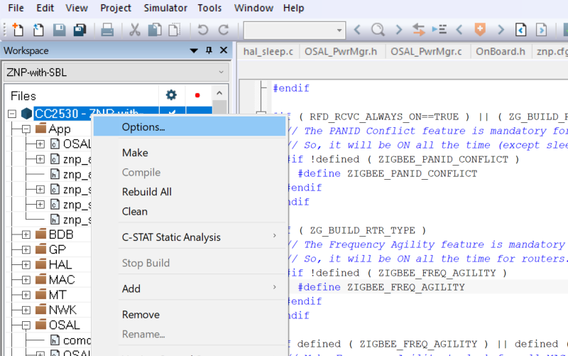

**ZigBee** is a stack of protocols intended to enable IoT devices to efforlessly form mesh networks and communicate with one another wirelessly. I've been fascinated with the ZigBee platform for a long time now, but I had always been put off by how corporate-y the technology looked like (and boy, I was right).

A couple years ago I decided to buy a few cheap **CC2530 boards** off AliExpress. The CC2530 is a SoC by Texas Instruments containing an 8051 clone as the main processor, with RAM (128K or 256K) and Flash, and the PHY for IEEE 802.15.4.

As with all cheap China hardware, there seem to be a **few versions** of the design which are then cloned by every other seller. These include:
 - A compact board with external antenna
 - A compact board with integrated antenna and antenna connector
 - A compact board with external antenna and dedicated RF frontend (CC2591)
 - A board with an additional MCU, which seems to be a C8051F320 (an 8051 clone with USB support form Silicon Labs \- this version is probably used for some specialized purpose by hobbists)
 - A board with integrated antenna and a programming header (what I have)

My boards look like this:

You can also get CC2531 boards, which have an USB interface on which a CDC device is exposed functionality identical to the CC2530 UART. These seem to be preferred by people hacking with RPi's, but I can't offer much insight on them, as I don't have any.

### So, how does one get started?
Ha! Nice question. And as it turns out, not a simple one.

The issue is that you can't just connect the module to your Arduino/RPi/Serial Terminal and be on your way transmitting frames. TI documents **two modes** of operation for the CC253x SoC's, none of which is available out-of-the-box:
- Stand-alone, where you write and compile your ZigBee application against the ZigBee and HAL libraries from TI, flash it to the CC253x board and it runs there;
- With an Host MCU, where you flash the CC253x with a special firmware once, and then you send commands to it from an host device running your applications.

The **first** mode of operation is what you would do to make a ZigBee product. It is better in terms of compactness and cost-effectiveness. However, it has a big disadvantage: you have to learn the SDK and the tooling from TI, which as you will see is not a particularly attractive endeavour.

With the **second** mode of operation, you have what TI calls a *ZigBee Network Processor (ZNP)*, which is a CC253x running the Z-Stack ZNP firmware, and then you write your application on whatever platform you're already familiar with and you make it talk to the ZNP through an UART. The rest of this article explains how to get started with this mode of operation. To prepare your boards, you need a piece of hardware and some software.

### Hardware
To **program** your CC253x boards, you need either a CC-DEBUGGER or a SmartRF04 Evaluation Board.

The CC-DEBUGGER costs ~50 EUR, and the SmartRF04EB cost several hundred EUR. You can purchase both from one of the big TI resellers (e.g. Mouser or Digi-Key). The first is a debugger/programmer device, while the second is a fully fledged evaluation board with an LCD, pushbuttons, a battery controller and other such amenities.

As with all things electronics, you can also buy cheap clones from China. For about 5 EUR shipped you can get something that is recognized by TI software as a SmartRF04EB but resembles and works like a CC-DEBUGGER. It looks like this and it usually includes the cable:

In theory, you could also use an Arduino/ATmega328P (or any other microcontroller you may like, if you got the skillz!) to program the CC253x, using a special firmware, which is what I was planning to do originally. However, the associated upload software seems to work very unreliably and after a lot of wasted hours I decided to just spend 5 EUR to get on with my life.

### Software

You need to download the following software from TI:
- *SmartRF Flash Programmer* (version 1, not 2!)
- *Z-Stack 3.0.2* (as of today it is the latest version; using a different version may not work as they seem to often make breaking changes - in such a case older versions are available to download)

You also need *IAR Embedded Workbench for 8051*, which is paid software by IAR Systems. It probably costs a lot and I bet they wouldn't even sell it to you. Luckily, the trial version is fine, but you have to make sure to select the time-limited version, as opposed to the size-limited version. I used version 10, but any version after version 8 should work ok.

Unfortunately all of the aforementioned software only runs on Windows. Luckily you only need it to prepare (and possibly test) the boards, and then you can forget about it!

### Recompiling the firmware
Now, the more adventurous readers have probably already found out that TI ships **pre-compiled binaries** of the ZNP firmware in Z-Stack 3.0.2. So why have I asked you to install IAR Embedded Workbench, when we could just have flashed those?

Very simple: the binaries provided by TI are compiled with mandatory UART flow control, which is very poorly documented, and it doesn't seem to work well with FTDI adapters (which are what I use). Furthermore, there are a couple compile flags that you may want to change, depending on which boards you have and how you plan to use them.

So, fire up IAR Embedded Workbench, activate/request a trial code as needed, and then open the ZNP firmware projects from _File > Open Workspace_. The project we need to recompile is located under the Z-Stack directory, at \Projects\zstack\ZNP\CC253x\znp.eww. After loading the project, go to _Project > Edit Configurations_ and select the "ZNP-with-SBL" configuration.

Under the file list to the left, expand the *Tools* directory and double click on the znp.cfg file. Add the following line to the end of it:

``-DZNP_ALT``

This flag is apparently not documented anywhere. It enables what is referred in the official documentation as the "Alternate pinout configuration", and it also disables hardware flow control. You can see it disabling flow control in the znp_app.c source file (under App). I have no idea on how it manages to change the pinout, and an SDK-wide ``grep`` didn't help at all.

If your board has the RF frontend, also add the following line:

``-DHAL_PA_LNA``

This is also not documented for the CC2530, but it is documented for other boards and a quick ``grep`` reveals that it does what it's supposed to do.

If you're already familiar with the ZigBee 3.0 protocol, you should also have a look at the f8wConfig.cfg and f8wZCL.cfg files, which contain various configuration flags.

Since you will be using the module with an external MCU, you should also remove the `POWER_SAVING` flag from the project options, otherwise in some cases the device will go to sleep immediately after commissioning, rendering the UART interface unusable. To do that, right click on the solution name in the Workspace explorer (as shown below), and select _Options > C/C++ compiler_. Then open the Preprocessor tab, and remove `POWER_SAVING` from the _Defined symbols_ list.

Now press F7 to Make.

The code compiled fine for me, but the post step to produce an ``hex`` file failed (thankfully, with an error message). To do it manually I went to the Projects\zstack\ZNP\tools directory, opened a PowerShell window, and typed the following command:

``.\znp.bat . "CC2530-ZNP-with-SBL"`` (replace CC2530 with CC2531 as needed)

Just FYI, that script changes to the directory passed as the first parameter (in our case, just the current directory) and then executes ``znp.js`` passing it the second parameter. Yes, that is a JavaScript script, executed inside the Windows Script Host, as a post-compile hook. I'm just as horrified as you. Let's get on with this.

After doing all this, you should have a new Projects\zstack\ZNP\CC253x\dev\CC2530-with-SBL.hex (or CC2531) file. The script also sometimes (but not always, go figure) shows a success popup. Please check the *Modified date* of the hex file. If the file was not updated (i.e. it's dated with the same date as the other files) something went wrong and you need to correct it before proceeding.

If everything went according to plan, put the file somewhere safe and proceed to the next step!


Previous versions of the SDK contained a document called "Z-Stack Compile Options", which detailed some of the compile flags I mentioned in this section. While it is technically no longer valid for Z-Stack 3.0.2, you may want to download it from the web and keep it around.


### Flashing
You should now have the CC253x-with-SBL.hex firmware, compiled with the appropriate flags. **Let's flash it**!

If your board has a **debugging breakout**, just connect to it with the ribbon cable. Otherwise, you will have to use jumper cables according to the following pintout:

Open SmartRF Flash Programmer, and make sure your programmer appears under the "System-on-Chip" tab in the table next to the "Interface:" label. If it doesn't, you have an issue with the programmer and you have to sort it out before proceeding.

Now try to press the "Read IEEE" button. If you see the MAC address appear in the textbox, you're up and running! Otherwise, check all connections and repeat (also check the orientation of the debugging header if you have one, and don't forget you have to power the board externally if you don't).

Select "Erase, program and verify" under "Actions", and then select the firmware we just compiled next to "Flash image:"; finally, press "Perform actions" and wait for the process to finish. If anything goes wrong, remove power from the board, reconnect and retry.

Repeat these steps for all the boards you want to program.

### We're done! Almost.
A few closing words.

First, you should **read** the "Z-Stack ZNP Interface Specification" document, under Documents\API. It talks about the physical interface. Some notable sections are:
- 2.2.1 CC2530, where you can find the pinout for the Alternate configuration;
- 2.2.3, 2.2.4 UART Transport and framing;
- 2.2.5 Inizialization and reset;
- 3 Command interface

Please note that you have to connect pin P2_0 (CFG1) to GND before applying power in order to enable the UART. Hear, hear... not documented. This is the biggest documentation fail, as the entire point of the ZNP firmware is to have a UART command interface, and they don't tell you how to enable it in the document that talks about the physical interface (or anywhere else, apparently).

You should also familiarize with the "Z-Stack Monitor and Test API" document, which documents all available commands divided by interfaces. It is quite curious that it is called *Monitor and Test*. It seems that the comand interface was originally intended to be used only with debugging and testing tools, and then some of the subsystems were documented *a posteriori* as being part of the ZNP mode of operation. I offer some trivia on this in the next section.

### Z-Tool
In Tools\Z-Tool you can find a little piece of software which can be used to **test commands**. Conveniently, it's made to work exactly with the MT commands that the ZNP firmware exposes. Not all subsystems documented in "Z-Stack Monitor and Test API" are available in Z-Tool, but the 5 subsystem that are listed in "Z-Stack ZNP Interface Specification" are.

When you start the software for the first time, you should go to Tools > Settings and disable all irrelevant COM ports (or Auto Scan) to avoid having Z-Tool send junk to all your serial devices every time you lunch it. You should also select the relevant COM ports one by one and click on Edit to select the correct baudrate (if you haven't changed it during compilation it's 115200) and make sure that handshakes are disabled, or it won't work. As soon as you begin fiddling with more than one board at a time, I suggest you to change the serial port numbers from the Device Manager.

Z-Tools also supports scripting in a proprietary language with classes, enums and namespaces, which, yeah, is absolutely mental.

Trivia: scripts have the `zjs` extension but the language doesn't resemble JavaScript at all.

More trivia: if you read the "Z-Stack Monitor and Test API" document very carefully, you will find clues pointing to an early version of it which probably was part of the engineering specification for Z-Tool.

Even more trivia: "Z-Stack Monitor and Test API" specifies the frame payload to be \[3, 256] bytes long, while "Z-Stack ZNP Interface Specification" specifies it to be \[3, 253] bytes long. The latter is probably the correct one: 253 + SOF + FCS = a nice 255, or 2^8-1 max bytes for the whole frame. The first document also specifies the payload to be 1+2+\[0, 250] bytes long, which contradicts itself and agrees with the other document.

### Concluding
We now have a ZigBee Network Processor. In the next article, we are going to explore the basics of ZigBee 3.0, and after that, we are going to finally exchange data between nodes.