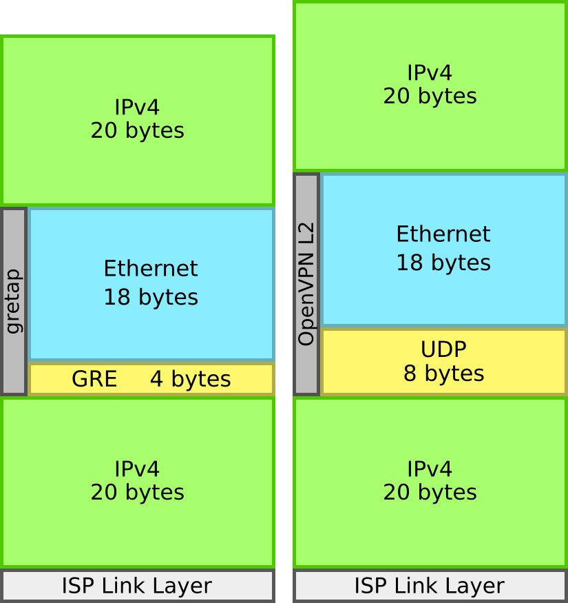

Last week, a friend of mine posed the interesting problem he was facing at the company he's working at of **streaming video reliably** from multiple commodity Internet connections. Since this is my kind of thing, I decided to give it a go.

After discussing the problem a bit, we came up with the following requirements:
* It should be implemented at the **network level**, to work with any streaming software and/or device
* It should provide near-instantaneous (or even no-interruption) **failover** to allow for seamless live streaming
* It should be **portable** (i.e. it shouldn't depend on specific Internet access technologies)
* _Don't reinvent the wheel_!

We did some brainstorming, and we decided the best way to achieve this involved using all of the Internet connections to set up a redundant tunnel to a **fixed gateway** machine in a datacenter. The rationale of the idea is that the machine in the datacenter is already connected to the Internet very well, so as long as at least one of our local Internet connections works, we can get stuff to the server, which then can get it out to the Internet from the same fixed IP address.

In this article I will try to outline various solutions to achieve that, as well as solutions _not_ to achieve that and why, in this case, they are not good ideas. I will use the term "local machine" to indicate the Linux machine we want to stream from (or, equivalently, the machine we will use to route the streaming from our network to the Internet), and "fixed gateway" to indicate the well-connected Linux machine in the datacenter.

### The solutions
After some investigating and documentation surfing and source code reading, I came up with a number of solution. Ultimately, one particular solution prevailed for its ease of deployment and robustness. However, as we will see in the next article... the solution doesn't work!

I will start from the very beginning, from a couple of solutions which don't really implement the original idea, to the solution of choice which we will be attempting to deploy in the field.

#### Dynamic policy routing
The first solution that came to my mind is somewhat similar to what many mainstream commercial solutions such as pfSense and EdgeOS do: having multiple kernel routing tables in place and dynamically switching over between them for outgoing packets depending on real time measurements (typically of latency, jitter or packet loss). This, as you can gather, is done at L3, it's a **kludge** (although one that has been perfected and works quite well for some applications), and it is commonly denoted as _Load Balancing_.

While it works well for Internet browsing, it poses **two issues** for video streaming:
* When one of the Internet connections drops, the firewall won't really be able to know what to do with connections that were being masqueraded out of a different interface, and the video stream will drop
* It might be difficult to make meaningful measurements for the switch over mechanism

While the second issue is somewhat workable (although, I don't think _well enough_ for seamless video streaming), the first issue is insurmountable without owning your own IP addresses and running BGP. Clearly not our case! On to the next solution.

#### Route two ffmpeg's and join them on the other side... somehow
So, this one's not very realistic, because I don't think `ffmpeg` could actually do it. But I'm still going to include it for the sake of analysis! As you've probably guessed, the idea would have been to relay the same `ffmpeg` stream to a fixed gateway over two different Internet connections. This could have been achieved both by duplicating the stream with `ffmpeg` plus policy routing (e.g. on the destination port, with a little help from `iptables`), and with `iptables` alone using the `TEE` module. The other half of the problem would have been de-duplicating the two streams on the other side, which is not a trivial problem and as far as I can see is one that `ffmpeg` can not solve.

#### Dynamic policy routing inside VPN tunnels
The solution is conceptually simple: bring up a number of VPN tunnels - one for each available Internet connection - to a fixed gateway, and policy route packets to one of them depending on the status of the underlying Internet connections, switching over when needed.

This is just like the first solution, but the VPN tunnels offer a solution to **avoid breaking connections** when switching links: while the tunnels themselves are possibly estabilished from behind one or multiple NATs, the tunnels allow to reach the fixed gateway with plain and simple **multipath IP routing**, which requires no particular support or configuration. NATting on the video stream packets is only done going out the fixed gateway, and since we may be able to get a dedicated IP for it, it could even be as simple as a pair of an SNAT and a DNAT rule (sometimes called 1-to-1 NAT).

OpenVPN allows to establish clear-text tunnels, and it's quite proven and stable technology. It can run over UDP, providing efficient, low-overhead L3 tunnels. So... Why not?

Because it's ugly! Yes, it really is. It's a kludge on top of a kludge, requiring a combination of kernel space and user space networking, scripts to dynamically monitor the situation and change the network configuration, and OpenVPN configuration files. A slightly better alternative would be to use a GRE tunnel in place of OpenVPN. But there's still the load balancing. I have to admit, I almost did go for this one. But then, something clicked in the back of my mind...

#### My name is Bonding, Linux Bonding... driver
On the 8th April of the year 1997, Linus Torvalds released Linux 2.0.30. A few weeks later, I was born. In the meanwhile, Donald Becker @ NASA (to whom we owe much of early Linux networking) devised the Beowulf patches, a set of modifications for the Linux kernel to add functionality useful for cluster computing. Among the patches, there was also _linux-2.0.30-bonding.patch_. The original patch, as far as I can tell, is lost to time, but in year 2000, Linux 2.2.15 was released, and the driver had made its way into the kernel tree. No - wait. It was integrated into the directory where Torvalds kept the source code. [Would you like to see some of it?](/misc-pages/03.oldcode)

What this very rudimentary driver did, was saving a list of _enslaved_ devices (added via ioctl's), and when it came time to transmit a packet, it iterated through this list and selected the first device that was up and running (literally - it checked for the `IFF_UP` and `IFF_RUNNING` flags :) and sent the packet out of it by calling `dev_queue_xmit()`.

Fast forward to today, the bonding driver has evolved _a lot_. We now have a dedicated directory in the kernel tree, `systemd-networkd` support and [a whole lot of documentation](https://www.kernel.org/doc/Documentation/networking/bonding.txt). ~~Unfortunately, it seems to be lacking `iproute2` support~~ wrong! found it (but the documentation is _written in C_), however we do have complete `sysfs` support which definitely makes up for it. It supports many bonding modes, and very importantly for us, **link monitoring**! Two flavours of it!

Link monitoring, a lot like load balancing, is based on the idea of probing the functionality of the communication channel to see if it's actually working. The difference is that link monitoring is done in the kernel driver, which means no finicky and kludgey user-space programs and scripts. It also means that as soon as stuff stops flowing, it will be noticed, as the mechanism is very low level and simple: the bonding driver will **poll** `dev->last_rx` for each slave device, and mark a device as inactive when that goes over a certain treshold. In addition, it can be configured to periodically send out **ARP probes** to still refresh that variable in case no real data is received for a while.

In addition to the classical failover operation mode, which in the latest version of the driver is called `active-backup`, the bonding driver also supports additional operation mode. An interesting one is `balance-rr`, which, as the name suggests, round-robins the packets over all available slaves. If all available slaves are backed by similar links, this has the interesting effect of increasing the average time the driver has as its disposal to notice a fault and inactivate a slave without loosing any packets. However, if the links are very different, this could give issues with UDP video streams, as packets are pretty much guaranteed to arrive out-of-order. This is not true for TCP, which of course has sequence numbers for reordering. However, average latency and jitter will rise to the maximum averages of all links, which might be undesirable.

#### So... is this it?
Yes, but not so fast. We still have something to sort out!

The more attentive readers will have noticed that, in the previous section, I talked about ARP probles. As we all know, ARP runs on the Link Layer. What's up with that? Well, the bonding driver does in fact **operate at L2**. This means we still have one last problem to analyze and solve, and it is **running L2 tunnels** to the fixed gateway, which we then will run with the bonding driver on top.

To do this, we can either get OpenVPN back in the game or use a GRE (or even VXLAN if that's your thing) tunnel. Depending on the choice, we will either run on UDP or on GRE. UDP has a fixed overhead of 8 bytes, while GRE, depending on the configuration, has 4-16 bytes of overhead. OpenVPN is implemented in user-space, while GRE runs in kernel space. In addition to this, it's a good idea to consider ease of configuration and flexibility: OpenVPN is more difficult to configure, but it can then run on the non-fixed side behind NATs, while GRE requires little configuration but most likely requires manual NAT configuration.

I'm going to go with GRE, but doing the same with OpenVPN shouldn't be much different. Linux [identifies a tunnel](https://github.com/torvalds/linux/blob/1566feea450cb0ffcdb47daf723f62640c9f616a/net/ipv4/ip_gre.c#L357) by source, destination, and key (which, interestingly, is not part of [the latest GRE RFC](https://tools.ietf.org/html/rfc2784)). Since each of our tunnels will have an unique source address, we don't actually need to key our tunnels, so our GRE headers will be just 4 bytes long.

Overall, our solution has 42 (ha!) bytes of **overhead**. This means having 1430 bytes of IP payload instead of the usual 1472 of a DSL Internet connection, or ~2.9% overhead. Could be better, but I think the benefit of having the bond driver manage failover for you outweights the wasted bytes.

In the next installment, we are going to try it! It's already out, so [go ahead](/blog/linux-redundant-ip-link-2) and read it.
